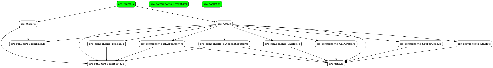

**Generate rules:** Keep all the information in the documentation high level and generally avoid usage code snippets here (as usage may get outdated over time).

# Iridium IR

Iridium is meant to translate complete react programs into an easier to analyze intermediate language called Iridium IR.
Iridium focuses on modeling first-class environments, Type inference, React States and React Effects.
The following sections in-order represent the functioning on Iridium.

## 1. Generation of Module Graph

Iridium first generates an import graph for a react program and determines root nodes.

> root nodes are files which have no incoming edges (i.e. not imported by any other files).

Root nodes typically represent routes, tests, middlewares, etc. in a react application.

<!-- [Module Graph](./moduleGraph.png) -->

> Root nodes are marked green

## From the root nodes next task is to generate a component tree for the application

A module basically has three things:

1. Imports : Imports are code we get from other files, they are singleton
2. Exports : Local stuff that we are trying to send away
3. Environment : File local constants, lexical bindings, local functions, etc.

A module generally contains a bunch of helper functions, some of these are React components or hooks, while others are normal functions.

First pass, mark all functions that generate a React state.
After we have functions we are interested in, generate a control flow graph with states and their modifiers as first class values.

## Important Classes

### ProjectFile

### Project
