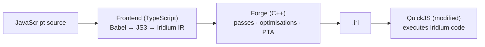

# Iridium

**Iridium** is a static analysis framework for JavaScript.

!!! note "Work in progress"
    This site is under construction. Most pages are stubs for now.

Iridium is built from three components:

| Component | Language | Location |
|---|---|---|
| Frontend | TypeScript | this repository |
| Forge (analysis) | C++ | `externalDeps/Iridium-Forge` |
| Runtime | C | `externalDeps/quickjs` |

## Where to next

- [Installation](getting-started/installation.md)
- [Quickstart](getting-started/quickstart.md)
- [Architecture](concepts/architecture.md)
- [Contributing](contributing.md)
